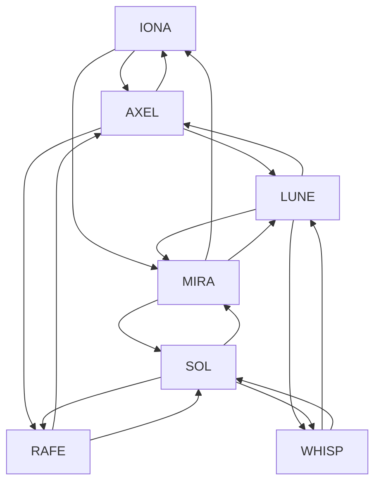

📝 ANSWER.md
Task 1 — Add an Albatross to the Picture
Original Image


Edited Image (With Albatross Added)


The edited image contains a clearly visible albatross added above the landscape while maintaining the original resolution and proportions.

Task 2 — User Manual
🪶 User Manual: Adding an Albatross to a Picture Using ChatGPT
Step 1: Sign Up for ChatGPT

Go to chat.openai.com

Click Sign Up

Choose:

Google account

Microsoft account

Email + password

Verify your email

Log in to access ChatGPT

Step 2: Upload the Original Picture

Click the 📎 paperclip icon

Select picture-template.jpeg

Wait for the preview to appear

Step 3: Add the Albatross  
Type a prompt such as:

Add an albatross flying above the landscape in this picture.

ChatGPT will generate a new edited version with the albatross added.

Step 4: Save the Final Image

Click the ⬇️ download icon

Save as final-albatross.jpeg

Insert both images into your answer.md

Step 5: Verify Requirements

Albatross must be clearly visible

Resolution must match original

Format must be .jpeg or .png

Task 3 — Full Graph
Graph Representation (Mermaid)



Task 4 — GPA Calculator (Single‑File Web App)
HTML Code

```html
<!DOCTYPE html>
<html lang="en">
<head>
<meta charset="UTF-8">
<title>GPA Calculator – Pascal</title>
<style>
    body {
        font-family: Arial, sans-serif;
        margin: 40px;
        background: #f5f7fa;
    }
    h1 {
        text-align: center;
        margin-bottom: 10px;
    }
    table {
        width: 100%;
        border-collapse: collapse;
        margin-top: 20px;
        background: white;
    }
    th, td {
        border: 1px solid #ccc;
        padding: 8px;
        text-align: center;
    }
    th {
        background: #e8eef5;
    }
    .tooltip {
        position: relative;
        display: inline-block;
        cursor: pointer;
        font-size: 20px;
        margin-left: 10px;
    }
    .tooltip .tooltiptext {
        visibility: hidden;
        width: 400px;
        background-color: #333;
        color: #fff;
        text-align: left;
        border-radius: 6px;
        padding: 10px;
        position: absolute;
        z-index: 1;
        top: 30px;
        left: 0;
    }
    .tooltip:hover .tooltiptext {
        visibility: visible;
    }
    button {
        margin-top: 20px;
        padding: 12px 20px;
        font-size: 16px;
        cursor: pointer;
        background: #2b6cb0;
        color: white;
        border: none;
        border-radius: 6px;
    }
    #result {
        margin-top: 20px;
        font-size: 20px;
        font-weight: bold;
    }
</style>
</head>

<body>

<h1>GPA Calculator</h1>

<h2>Your Program: Bachelor of Computer Science</h2>

<div>
    <strong>GPA Information</strong>
    <span class="tooltip">ℹ️
        <span class="tooltiptext">
            <strong>Translated GPA Document:</strong><br><br>
            GPA is calculated by multiplying each course grade by its credit,
            summing all results, and dividing by total attempted credits.
            Grades follow the Ilia State University scale where:
            A = 4.0, B = 3.0, C = 2.0, D = 1.0, F = 0.0.
            Only passed courses count toward earned credits.
        </span>
    </span>
</div>

<table id="courseTable">
    <thead>
        <tr>
            <th>Course</th>
            <th>Credit</th>
            <th>Grade</th>
            <th>Passed</th>
        </tr>
    </thead>
    <tbody></tbody>
</table>

<button onclick="calculateGPA()">Calculate GPA</button>
<button onclick="calculateAI()">Calculate with Introduction to AI</button>

<div id="result"></div>

<script>
    const courses = [
        {course: "Introduction to AI", credit: 6, grade: 70, passed: "No"},
        {course: "Programming I", credit: 6, grade: 95, passed: "Yes"},
        {course: "Programming II", credit: 6, grade: 88, passed: "Yes"},
        {course: "Calculus I", credit: 6, grade: 77, passed: "Yes"},
        {course: "Calculus II", credit: 6, grade: 65, passed: "Yes"},
        {course: "Physics", credit: 6, grade: 55, passed: "No"},
        {course: "Algorithms", credit: 6, grade: 90, passed: "Yes"},
    ];

    const extraCourses = [
        {course: "Data Structures", credit: 6, grade: 100, passed: "Yes"},
        {course: "Computer Architecture", credit: 6, grade: 100, passed: "Yes"},
        {course: "Operating Systems", credit: 6, grade: 100, passed: "Yes"},
        {course: "Databases", credit: 6, grade: 100, passed: "Yes"},
        {course: "Computer Networks", credit: 6, grade: 100, passed: "Yes"},
    ];

    const allCourses = [...courses, ...extraCourses];

    function loadTable() {
        const tbody = document.querySelector("#courseTable tbody");
        allCourses.forEach(c => {
            const row = document.createElement("tr");
            row.innerHTML = `
                <td>${c.course}</td>
                <td>${c.credit}</td>
                <td>${c.grade}</td>
                <td>${c.passed}</td>
            `;
            tbody.appendChild(row);
        });
    }

    function gradeToGPA(grade) {
        if (grade >= 90) return 4.0;
        if (grade >= 80) return 3.0;
        if (grade >= 70) return 2.0;
        if (grade >= 60) return 1.0;
        return 0.0;
    }

    function calculateGPA() {
        let totalPoints = 0;
        let totalCredits = 0;

        allCourses.forEach(c => {
            const gpa = gradeToGPA(c.grade);
            totalPoints += gpa * c.credit;
            totalCredits += c.credit;
        });

        const gpa = (totalPoints / totalCredits).toFixed(2);
        document.getElementById("result").innerText = "GPA: " + gpa;
    }

    function calculateAI() {
        let totalPoints = 0;
        let totalCredits = 0;

        allCourses.forEach(c => {
            let grade = c.grade;
            if (c.course === "Introduction to AI") {
                grade = c.grade + 30;
            }
            const gpa = gradeToGPA(grade);
            totalPoints += gpa * c.credit;
            totalCredits += c.credit;
        });

        const gpa = (totalPoints / totalCredits).toFixed(2);
        document.getElementById("result").innerText =
            "GPA with Introduction to AI: " + gpa;
    }

    loadTable();
</script>

</body>
</html>
```
